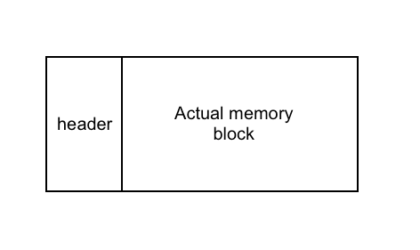

# memory allocator

### sbrk

sbrk(int size)，size 为正，增大 data 区，否则，减小 data 区

### 释放 free or release

内存是连续的，长的一条，我们无法向操作系统释放位于中间的内存块。需要保证 heap 区的完整性与连续性

内存不一定要还给操作系统，也可以自己保存着，标记为 free，以及标记大小

### 每块分配了的内存，有一个结构体

```c
struct header_t {
    size_t size;
    unsigned is_free;
};
```


