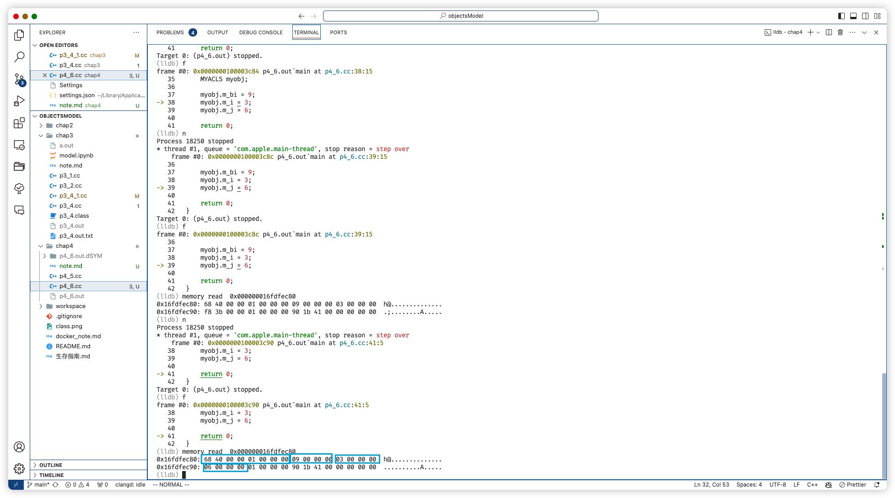
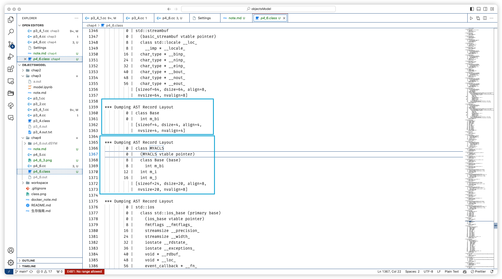

## 数据语义学

### 单一继父类不带虚函数的 数据成员布局



```lldb
24
MYACLS::m_i = 12
MYACLS::m_j = 16
MYACLS::m_bi = 0
```

从内存图来看，m_bi 的偏移量应该是 8，但是这里打印出来却是 0。
可以看见，单是看偏移量，并不能确定对象的内存布局



（确实，这个看内存布局还是挺好的，但是就是看不到虚函数表的情况）

在 “继承” 与 “虚函数” 的加持下，打印偏移量并不准确

### this 指针 的调整

在 delete 的时候，一定要注意

```cpp
#include <cstdio>
#include <iostream>
using namespace std;

class Base1 {
public:
    int m_b1i;

public:
    Base1()
    {
        printf("Base1::Base1()的this =\t%p\n", this);
    }
};

class Base2 {
public:
    int m_b2i;

public:
    Base2()
    {
        printf("Base2::Base2()的this =\t%p\n", this);
    }
};

class Derived : public Base1, public Base2 {
public:
    int m_di;

public:
    Derived()
    {
        printf("Base2::Base2()的this =\t%p\n", this);
    }
};

int main(void)
{
    printf("sizeof(Base1)\t=\t%lu\n", sizeof(Base1));
    printf("sizeof(Base2)\t=\t%lu\n", sizeof(Base2));
    printf("sizeof(Derived)\t=\t%lu\n", sizeof(Derived));
    printf("&Derived::m_b1i\t=\t%p\n", &Derived::m_b1i);
    printf("&Derived::m_b2i\t=\t%p\n", &Derived::m_b2i);
    printf("&Derived::m_di\t=\t%p\n", &Derived::m_di);
    Base2* pbase2 = new Derived();
    // delete pbase2; // 这里在删除的时候遇到问题
    // delete (Base1*)pbase2;  // 这里也是遇到了问题
    // delete reinterpret_cast<Base1*>(pbase2); // 也遇到了问题
    delete ((char*)(pbase2)-4); // 这里就正常
    printf("delete pbase2;");
    return 0;
}
```

这段的输出：

```sh
sizeof(Base1)	=	4
sizeof(Base2)	=	4
sizeof(Derived)	=	12
&Derived::m_b1i	=	0x0
&Derived::m_b2i	=	0x0
&Derived::m_di	=	0x8
Base1::Base1()的this =	0x15b605fa0
Base2::Base2()的this =	0x15b605fa4
Base2::Base2()的this =	0x15b605fa0
delete pbase2;
```

对象的内存布局

```class
*** Dumping AST Record Layout
         0 | class Derived
         0 |   class Base1 (base)
         0 |     int m_b1i
         4 |   class Base2 (base)
         4 |     int m_b2i
         8 |   int m_di
           | [sizeof=12, dsize=12, align=4,
           |  nvsize=12, nvalign=4]
```

### 虚基类（虚继承）问题

主要是解决"菱形继承问题"

程序员编程方面的变化：

只在孙子的初始化列表中，初始化 Grand 的数据成员（如果是有参构造）

#### 虚基类的 内存布局

#### 虚基类表

4~7 字节（32 位）

0~3 字节（32 位）

#### 虚继承 与 实继承 顺序问题

实继承 的成员，一直会放在最前

虚继承 的成员，一直会放在最后

### 想法：重新编译，重新运行

### 数据成员指针

需要注意一下 编译器 的自动处理
