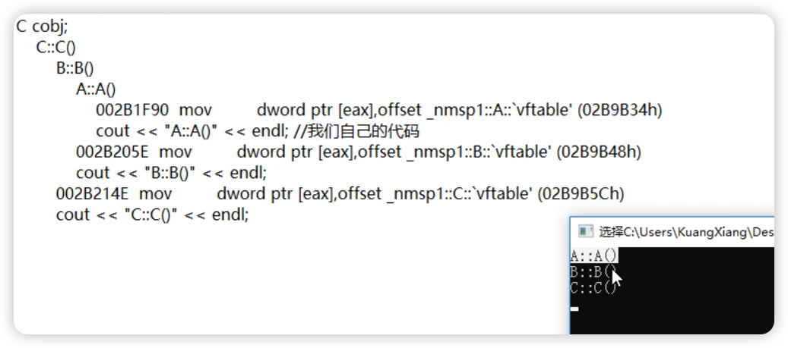

# chap6 - 构造语义学

## 构造函数

构造函数是：根据继承关系递归的进行调用的



### 初始化列表的 构造时机

### 构造函数中 调用 虚函数

1. 直接调用（不走虚函数表）
2. 间接调用（走虚函数表）

这个环境是 vs2017 的。这个比较有意思

## 对象拷贝

### 析构函数 被合成

1. 如果继承一个基类，基类中带析构函数，那么编译器就会给我们合成出一个析构函数

2. 如果类成员 是 一个类类型成员，并且这个成员带析构函数，那么编译器也会为我们合成出一个析构函数，这个被合成出来的析构函数的目的就是：调用这个成员的析构函数。

### 析构函数 被扩展

如果我们有 自己的析构函数，那么编译器就会在必要的时候拓展我们的析构函数：

1. 如果类成员 m_j 是 类类型，并且这个 m_j 的类有析构函数，那么编译器就会拓展析构函数，加入 m_j 的析构函数。例如：

先执行类的析构函数，再执行子类的析构函数

2. 继承关系

```cpp
#include <iostream>
using namespace std;

class JI {
public:
    virtual ~JI()
    {
        cout << "JI::~JI()" << endl;
    }
};

class A : public JI {
public:
    virtual ~A()
    {
        cout << "A::~A()" << endl;
    }
};

int main(void)
{
    A a;
    return 0;
}
```

输出：

```cpp
A::~A()
JI::~JI()
```

可以看到，先析构子类，再调用父类

## 全局对象的 构造与析构

## 局部 静态对象

### 局部静态对象的 构造与析构

```cpp
void myfunc() {
    static A s_aobj1;
    static A s_aobj2;
}
```

1. 如果我们不调用`myfunc()`，那么这个静态对象根本不会被构造出来。

2. 如果多次调用`myfunc()`，只会调用一次构造函数。

大多数编译器会将 静态对象 写死

好书推荐：《程序员的自我修养*链接*装载与库》

3. 静态局部对象 初始化为 0

4. 局部静态对象的析构，是在 main 函数执行结束之后才被调用。

5. 如何保证：静态局部对象只会被构造一次的呢？

可以在汇编中看到这两行：

（x86_64 msvc）

```asm
jle _nmsp1::myfunc+0ABh (0125295Bh)  --> 这是与标记进行比较

01252918 call __Init_thread_header --> 对象的后4个字节被设置为了 ff ff ff ff
...
01252953 call __Init_thread_footer --> 对象的后4个字节被设置为了 01 00 00 80
```

发现后面几个字节变了

6. 那么如何记录对象，以便于最后释放呢？

```asm
push offset `_nmsp1::myfunc`::`2'::`dynamic atexit destructor for 's_aobj1'' (01258EA0h)
call _atexit
```

这个`_atexit`的作用是登记一些信息，用来在 main 函数结束以后，需要做一些事情

### 局部静态对象数组的 内存分配

编译器不一定会为 大数组 分配内存。
