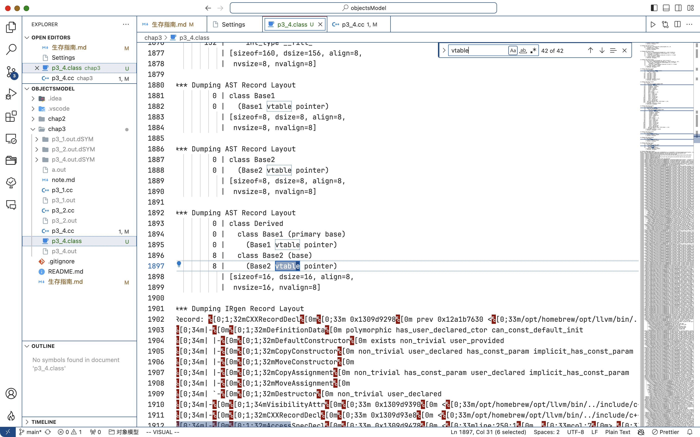

### lldb 的使用

- b 断点
- r 运行直到断点
- s 进入
- n 下一步
- bt 栈
- f 帧
- c 继续执行

可以参考 https://dbgtech.github.io/Tools/lldb-using.html

#### 查看对象模型

```lldb
im look -r -v -s "vtable for A"
```

#### 反汇编

```lldb
disassemble --frame
```

#### 上下翻页

#### python api

1. 启动 python 解释器

```lldb
script
```

2. 获取当前 frame

```py
frame = lldb.frame
```

3. 遍历虚函数表

```py
>>> for i in range(8):
...     lldb.debugger.HandleCommand(f"p (Func)(vptr1[{i}])")
...
(Func) $0 = 0x0000000100002f54 (p3_4.out`Derived::f() at p3_4.cc:34)
(Func) $1 = 0x0000000100002f90 (p3_4.out`Base1::g() at p3_4.cc:13)
(Func) $2 = 0x0000000100002fcc (p3_4.out`Derived::i() at p3_4.cc:39)
(Func) $3 = 0x0000000100003008 (p3_4.out`Derived::h() at p3_4.cc:43)
(Func) $4 = 0x0000000100003044 (p3_4.out`Derived::mh() at p3_4.cc:48)
(Func) $5 = 0x0000000100003080 (p3_4.out`Derived::mi() at p3_4.cc:52)
(Func) $6 = 0x00000001000030bc (p3_4.out`Derived::mj() at p3_4.cc:56)
(Func) $7 = 0xfffffffffffffff8
```

#### %x 与 %p

`%p`与`%x`的差不不大，

差别如下：

```cpp
%p = 0x10481f0c4
%x = 481f0c4
%lx =  10481f0c4
```

### objdump

```sh
objdump -d <可执行文件>
```

查看编译器生成的默认构造函数

```sh
objdump -C -t <可执行文件>
```

`-C` 选项告诉 `nm` 命令对 C++ 符号进行 demangling（去花式符号）。这样可以将 C++ 编译器产生的符号名转换成人类可读的形式，以便更容易理解和分析输出结果。
`-t` 选项告诉 `objdump` 命令显示符号表。这将列出目标文件或可执行文件中的所有符号及其地址。

显示汇编

### 查看内存布局

```sh
clang++ -Xclang -fdump-record-layouts -fsyntax-only p3_4.cc > p3_4.class
```



`*** dumping IRGen Record layout`之前，正好有我们定义的类的布局

### nm 命令

`-C` 选项告诉 `nm` 命令对 C++ 符号进行 demangling（去花式符号）。这样可以将 C++ 编译器产生的符号名转换成人类可读的形式，以便更容易理解和分析输出结果。

### docker 的 cpp 开发环境

很遗憾的就是，查看内存布局这个功能，linux 和 windows 有很好的解决方案

linux 下的 clang 有 `-fdump-class-hierarchy`，可以直接看到内存布局的。
然而作为 mac 原生的 clang，并没有这个选项

遂放弃，使用虚拟机了（，安装 asahi linux 的时候出现了问题
